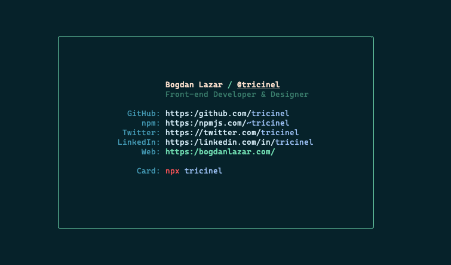

# It's me, Bogdan!



## Usage

```sh
npx tricinel
```

### Create your own

```sh
npx degit tricinel/npmcard my-card
cd my-card
yarn
```

The project comes with an easy to modify [configuration file](./src/config.js) where you can setup your own information.

**Available commands**

- `yarn lint` - lint your JS files inside of `src` using ESLint
- `yarn format` - format your JS files inside of `src` using Prettier
- `yarn build` - build the final output. This is also ran before you publish your package
- `yarn develop` - one time build and display of your card
- `yarn develop:watch` - watch for changes and build and display your card

#### Contributing

For details, check out the [Contributing][contributing] guide.

#### LICENSE

MIT

##### Huge thanks! :smiley:

Credits go out to **[Tierney Cyren](@bitandbang)** for contributing to this awesome project! **[NPX Card Profile](https://github.com/bnb/bitandbang)** :star::star::star:

[contributing]: ./Contributing.md
